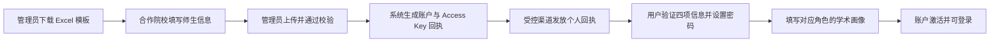
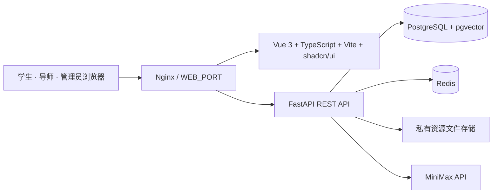
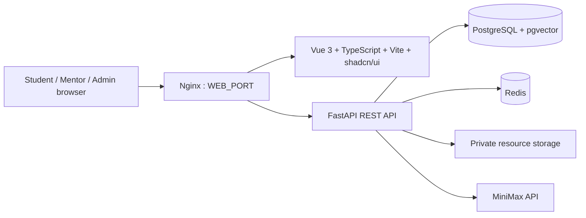

<div align="center">

# 🎓 智导未来 · AcademicNexus

### 面向合作高校的 AI 学术发展与导师双向选择平台

**AI-powered academic growth, resource recommendation, and mutual mentor matching for partner universities.**

[](#release-status)
[](#快速开始-debian)
[](#系统架构)
[](#系统架构)

[中文主文档](#zh-cn) · [English Guide](#english-guide) · [快速开始](#quick-start) · [接口总览](#api-map) · [安全说明](#security)

</div>

> [!IMPORTANT]
> **当前版本：`alpha-0822-NR`**
> `NR` = **Not Released / 尚未发布**。该版本仅用于受控 Alpha 验证，尚不应直接作为生产环境对外开放。

---

<a id="zh-cn"></a>

# 中文主文档

## 项目定位

智导未来（AcademicNexus）服务于合作高校的学生、导师与管理员，以统一的学术画像为基础，提供导师匹配、师生双向选择、学习资源推荐和 AI 学术咨询能力。

系统不提供面向公众的自由注册。高校通过管理员导入的 Excel 模板预录入师生身份；学生和导师仅能使用本人回执中的四项信息激活账户。学校中文全称与学院中文全称贯穿导入、画像、匹配、双选和管理后台。

## 已实现模块

| 模块 | 已实现能力 | 关键实现 |
| --- | --- | --- |
| 用户与预注册 | Excel 模板下载、批量导入、合规校验、回执生成、一次性 Access Key 激活、登录与改密 | 账户名由学校简称、角色与学工号自动生成；例如 `CUC_S20240001`、`CUC_TT10086`。 |
| 学术画像 | 学生与导师分角色的必填画像填写、查看与更新 | 标签字段使用 JSON 存储，保留后续向量化/语义检索扩展空间。 |
| 导师匹配 | 全校同校候选池、本学院优先、可解释画像混合评分 | 当前算法版本 `profile-hybrid-v1`，返回分项得分与共同关键词。 |
| 师生双向选择 | 学生表达意向、导师主动邀请、确认、拒绝、撤销、名额与特例控制 | 数据库锁与事务防止并发超额、同一学生被重复确认。 |
| 学习资源 | 课程、论文、书籍的浏览、推荐、上传、下载与导师存储额度 | 资源以主题和标签匹配学生画像，导师资源总量可由管理员调整。 |
| AI 学术助手 | 多轮对话、会话历史、上下文、MiniMax 接入、AI 选导师咨询 | 调用前原子预占配额；上游调用失败时自动返还次数与余额。 |
| 管理后台 | 预注册账户、学生/导师账户、密码、AI 配额、资源配额、双选设置与记录管理 | 支持批量状态调整、删除未激活预注册、设置个人例外规则。 |

## 核心业务流程

### 1. 合作院校预注册与账户激活



导入模板固定包含以下列：

| 列 | 规则 |
| --- | --- |
| 学校英文简称 | 2–12 位字母或数字，用于生成不可修改的账户名。 |
| 学校中文全称 | 必填，长度 2–160。 |
| 学院中文全称 | 必填，长度 2–160。 |
| 用户类型 | 支持 `student` / `mentor`、`S` / `T`、`学生` / `导师`。 |
| 中文真实姓名 | 必填，长度 2–120。 |
| 学工号 | 必填；以文本处理，保留前导零；支持字母、数字、下划线和连字符。 |

系统会校验表头、工作表名称、空行、格式、同一文件内账户重复，以及与已导入/已激活账户的冲突。导入成功后回执仅在该次下载中提供 Access Key 明文。

Access Key 格式为 `XXXX-ABCD-XXXX-XXXX`：12 位随机数字与 4 位随机大写字母，由密码学安全随机数生成器生成。数据库只保存 Key 的密码哈希及带服务端 Pepper 的 HMAC 指纹；指纹具备全局唯一约束。激活完成后 Key 状态变为已激活，无法再次使用。

### 2. 学术画像

学生完成画像时必须填写：研究兴趣、技能、成绩与学业表现、学术目标、科研经历。

导师完成画像时必须填写：研究方向、代表论文、科研项目、培养风格。

每个画像都关联到用户预注册时确定的学校与学院。画像完成状态由 `profile_completed_at` 记录；注册第二步未完成前，账户不可正常进入业务功能。

### 3. 可解释导师匹配

当前匹配服务以显式标签和文本信号实现稳定、可审阅的冷启动匹配，不把稀疏 Alpha 数据伪装成已训练模型。

候选对象必须同时满足：账户启用、角色正确、画像已完成、与当前用户属于同一所学校。排序顺序为：

1. 同一学院的候选人优先；
2. 再按画像混合分数从高到低；
3. 姓名与账户名作为稳定的最终排序键。

匹配总分为 0–100，计算方式如下：

| 维度 | 权重 | 比较内容 |
| --- | ---: | --- |
| 研究契合度 | 70% | 学生研究兴趣与导师研究方向。 |
| 技能契合度 | 15% | 学生技能与导师研究方向、项目、代表论文。 |
| 发展契合度 | 15% | 学生目标/科研经历与导师项目/培养风格。 |

API 同时返回每个维度的得分和命中的共同术语。后续接入嵌入模型与向量数据库时，将在既有 `matching` 服务边界内替换或融合排序器，而不改变前端与双选状态机的接口。

### 4. 师生双向选择状态机

学生可对导师发起意向；导师可对学生发出邀请。双方操作会落入同一条选择记录，状态包含：

```text
pending_student  学生已选择，等待导师确认
pending_mentor   导师已邀请，等待学生接受
confirmed        双方确认完成
rejected         导师拒绝
cancelled        学生撤销、确认其他导师或管理员释放
```

实现保障：

- 学生确认任一导师后，系统会在同一事务内取消该学生其他未完成选择；
- 导师容量会同时计入已确认人数和待学生响应的邀请；
- 选择设置、用户记录和确认过程使用行锁，避免多标签页或并发请求造成超额；
- 管理员可配置全局开关、默认导师容量、默认学生选择数；
- 管理员还可对单个学生/导师设置容量、选择上限、`first_come` 模式及不受限特例；
- 管理员可检索记录并单条或批量释放已选关系。

### 5. 学习资源与推荐

资源基础表统一保存标题、说明、主题、标签、发布状态、外部链接或本地文件信息；具体类型通过一对一扩展表保存特有元数据：

| 类型 | 专有信息 |
| --- | --- |
| 课程 `course` | 提供方、级别、时长。 |
| 论文 `paper` | 作者、刊物、DOI、年份。 |
| 书籍 `book` | 作者、出版社、ISBN、年份。 |

导师可管理自己创建的资源与文件；默认总存储额度为 200 MB，可由管理员对单人调整。学生可以浏览全部已发布资源，并按研究兴趣与技能获得推荐列表。

### 6. AI 学术助手与配额

MiniMax API 只通过 `MINIMAX_API_KEY` 环境变量读取，绝不写入前端或版本控制。当前对话主题包括：

- 学术规划 `academic_planning`
- 导师咨询 `mentor_consultation`
- 学习路线 `learning_roadmap`
- 双选顾问 `selection_advisor`

会话、消息、上下文摘要和使用事件均持久化。上下文长度分别受到消息条数和字符数上限控制。AI 配额以 Asia/Shanghai 自然日计量：个人每日上限、个人余额、项目每日总上限共同生效；项目默认上限为 `500`，仅可通过服务端环境配置改变。管理员可调整个人计划、余额、个人日上限及当日用量，但不能通过后台突破项目级环境上限。

## 系统架构



| 层级 | 技术与职责 |
| --- | --- |
| 前端 | Vue 3、TypeScript、Vite、shadcn/ui；提供中文/英文切换、分角色工作台。 |
| 反向代理 | Nginx 对外承载 Web 端，并反向代理 API 请求。 |
| 后端 | FastAPI、SQLAlchemy、Pydantic；按认证、画像、匹配、双选、资源、AI 等领域模块化。 |
| 数据 | PostgreSQL 16 + pgvector 保存事务数据与未来向量能力；Redis 预留缓存/会话能力。 |
| 迁移 | Alembic 管理结构迁移，容器启动时执行 `alembic upgrade head`。 |
| 部署 | Docker Compose 编排 postgres、redis、api、web、nginx 五个服务。 |

## 数据模型

| 领域 | 主要表 |
| --- | --- |
| 租户与身份 | `tenants`、`users`、`roles`、`user_roles`。 |
| 预注册 | `pre_registration_batches`、`pre_registrations`。 |
| 学术画像 | `student_profiles`、`mentor_profiles`。 |
| 导师双选 | `selection_settings`、`student_selection_settings`、`mentor_selection_settings`、`mentor_selections`。 |
| 学习资源 | `resources`、`courses`、`papers`、`books`、`mentor_resource_quotas`。 |
| AI | `ai_conversations`、`ai_messages`、`ai_user_quotas`、`ai_user_daily_usage`、`ai_project_daily_usage`、`ai_usage_events`。 |

数据库使用 UUID 主键，并以外键、唯一约束、检查约束和索引维持角色、租户、激活码、资源类型与双选关系的完整性。

<a id="api-map"></a>

## 接口总览

所有业务接口位于 `/api/v1`；交互式接口文档可通过 `http://<host>:<API_PORT>/docs` 在服务器本机访问。

| 接口分组 | 路径前缀 | 主要能力 |
| --- | --- | --- |
| 身份认证 | `/auth` | 激活预注册账户、登录、当前用户、语言偏好、修改密码。 |
| 学术画像 | `/profiles` | 完成激活画像、读取与更新学生/导师画像。 |
| 数据概览 | `/dashboard` | 按当前角色返回看板统计、消息与待办数据。 |
| 管理用户 | `/admin/users` | 查询、编辑、批量启停学生/导师与重置密码。 |
| 预注册管理 | `/admin/pre-registrations` | 模板、导入、查询、删除与批量删除未激活账户。 |
| 匹配 | `/matching` | 学生查导师、导师查学生，含画像评分明细。 |
| 双向选择 | `/selection`、`/admin/selection` | 意向、邀请、确认、拒绝、撤销、设置、记录与释放。 |
| 学习资源 | `/resources`、`/mentor/resources`、`/admin/resource-quotas` | 浏览、推荐、上传、下载、资源与额度管理。 |
| AI 助手 | `/ai`、`/admin/ai` | 会话、消息、个人配额与管理员配额管理。 |

<a id="quick-start"></a>

## 快速开始（Debian）

项目提供 [scripts/manage.sh](scripts/manage.sh) 作为 Alpha 生命周期管理脚本。它会在 Debian 上安装 Docker 依赖、引导创建本地密钥，并管理项目启动、停止和清理。

```bash
git clone <YOUR_GITHUB_REPOSITORY_URL> academicnexus
cd academicnexus
chmod +x scripts/manage.sh

# 0. 安装 Docker Engine、Buildx 与 Docker Compose 插件（仅 Debian）
./scripts/manage.sh install

# 1. 交互式输入 HTTP 端口、管理员信息和可选的 MiniMax API Key，然后启动
./scripts/manage.sh init
```

`init` 会生成权限为 `600` 的 `.env`，自动产生 PostgreSQL 密码、JWT 签名密钥与 Access Key Pepper；脚本不会打印这些随机密钥。启动后访问：

```text
http://<服务器 IP>:<初始化时选择的端口>
```

### 中国大陆网络下的 Docker 软件源备用配置

若服务器无法连接 `download.docker.com`，但运行在阿里云 ECS VPC 网络中，可在安装时临时改用阿里云 Docker CE 镜像；软件包仍会由 Docker GPG Key 验签：

```bash
DOCKER_APT_REPOSITORY=http://mirrors.cloud.aliyuncs.com/docker-ce/linux/debian \
  ./scripts/manage.sh install
```

该变量只影响 Docker 安装软件源，不会写入项目 `.env`。阿里云镜像站当前提供 Debian `trixie` 的 Docker CE 索引；优先使用官方源，只有官方 CDN 网络不可达时才使用此备用方式。

### 日常运维命令

| 命令 | 作用 |
| --- | --- |
| `./scripts/manage.sh start` | 构建（如需要）并启动所有服务。 |
| `./scripts/manage.sh stop` | 停止服务，保留数据库和资源。 |
| `./scripts/manage.sh restart` | 停止后重新启动。 |
| `./scripts/manage.sh status` | 显示服务状态。 |
| `./scripts/manage.sh logs` | 持续查看最近服务日志。 |
| `./scripts/manage.sh destroy` | 输入 `DESTROY` 后删除项目容器、卷、上传资源和 `.env` 密钥；保留源码、Git 历史和不相关 Docker 资源。 |

> [!TIP]
> 初次执行 `install` 后，请重新登录系统或运行 `newgrp docker`，以便不使用 `sudo` 调用 Docker。

### 本地开发

```bash
cp .env.example .env
# 使用独立的随机值替换每个 CHANGE_ME；绝不可提交 .env。
docker compose up --build
```

对外入口由 Nginx 使用 `WEB_PORT` 提供；开发 API 端口使用 `127.0.0.1:${API_PORT}` 绑定，仅可从服务器本机访问。

## 配置项

| 环境变量 | 说明 | 是否敏感 |
| --- | --- | --- |
| `WEB_PORT` / `API_PORT` | Nginx 对外端口与本机 API 调试端口。 | 否 |
| `POSTGRES_PASSWORD` | PostgreSQL 数据库密码。 | 是 |
| `JWT_SECRET_KEY` | 登录令牌签名密钥。 | 是 |
| `ACCESS_KEY_PEPPER` | Access Key HMAC 指纹服务端 Pepper。 | 是 |
| `INITIAL_ADMIN_*` | 首次启动时创建的管理员资料。 | 密码敏感 |
| `MINIMAX_API_KEY` | MiniMax 服务端 API Key；留空则 AI 功能返回未配置状态。 | 是 |
| `AI_DAILY_PROJECT_LIMIT` | 项目每日 AI 调用硬上限，默认 `500`。 | 运维配置 |
| `RESOURCE_MAX_UPLOAD_MB` | 单资源最大上传大小。 | 否 |
| `MENTOR_RESOURCE_DEFAULT_QUOTA_MB` | 新导师默认总资源空间，默认 `200`。 | 否 |

请仅以 [.env.example](.env.example) 作为配置模板。真实 `.env` 被 Git 忽略，不应通过聊天、截图、Issue 或提交记录传播。

<a id="security"></a>

## 安全与隐私

- `.gitignore` 已排除 `.env`、私钥格式、本地密钥目录、导入回执、上传资源、运行数据、旧版原型与内部策划资料；
- 管理员不存在仓库内置默认密码，首次管理员仅从私有环境变量创建；
- 用户密码和 Access Key 均只保留验证所需的受保护值，不保存 Access Key 明文；
- Nginx 为唯一公开入口；开发 API 仅监听本机回环地址；
- CORS 来源明确配置；AI 调用次数在数据库事务中预占并审计；
- `destroy` 仅清除精确的项目容器、卷、资源目录与 `.env`，不会清除 Docker 或其他项目。

推送 GitHub 前可执行：

```bash
git status --ignored
git check-ignore -v .env OLD_TSS_docker_oneclick "智导未来——AI驱动的学术发展与教学互动平台.pdf" "MiniMax文档.md"
```

## 开发与验证

容器环境中的验证命令：

```bash
# 后端：安全、预注册、注册流程、画像、匹配、双选、资源、AI 配额等测试
docker compose exec -T api pytest -q

# 前端：TypeScript 类型检查与 Vite 生产构建
docker compose exec -T web npm run build
```

新增数据库结构时，使用 Alembic 创建迁移并在干净数据库中验证升级；不要直接在生产服务器修改代码或手工变更表结构。

## 目录结构

```text
academicnexus/
├── backend/                 # FastAPI 领域服务、模型、Alembic 迁移和测试
├── frontend/                # Vue 3 双语 Web 应用与 shadcn/ui 组件
├── infra/nginx/             # Nginx 反向代理配置
├── scripts/manage.sh        # Debian 安装与 Alpha 生命周期脚本
├── docs/                    # 阶段设计文档
├── storage/                 # 运行时资源挂载点（仅保留 .gitkeep）
├── docker-compose.yml       # Docker First 服务编排
└── .env.example             # 安全的环境变量模板
```

<a id="release-status"></a>

## 版本状态

| 版本 | 状态 | 说明 |
| --- | --- | --- |
| `alpha-0822-NR` | 内部 Alpha / 未发布 | 当前版本；用于合作院校前期验证。 |

后续所有尚未发布版本均使用 `-NR` 后缀。下一阶段将聚焦生产域名与 TLS、可观测性、向量检索、数据治理和 Beta 上线加固。

---

<a id="english-guide"></a>

# English Guide

## Overview

AcademicNexus is an AI-enabled academic development platform for partner universities. It connects pre-registered students and mentors through structured academic portraits, explainable matching, mutual selection, resource recommendations, and a quota-governed AI assistant.

Public self-registration is intentionally unavailable. Partner institutions provide roster data through an administrator-managed Excel import. Institution and college names in Chinese are mandatory identity fields across import, profiles, matching, selection, and administration.

## Implementation at a glance

| Area | Current implementation |
| --- | --- |
| Identity | Validated Excel pre-registration, generated immutable username, one-time Access Key activation, role-based sign-in and password change. |
| Portraits | Separate student and mentor portraits; JSON tag fields are ready to feed a future embedding/vector pipeline. |
| Matching | `profile-hybrid-v1`; same institution is required, same college ranks first, then a transparent 70/15/15 hybrid score. |
| Mutual selection | Intent, invitation, confirmation, rejection and cancellation, backed by transactional capacity and single-match guarantees. |
| Resources | Course, paper and book catalog with tag-based recommendations, file download, and per-mentor storage quotas. |
| AI | MiniMax server-side integration, persisted conversations, bounded context, user credits/daily limits and an environment-controlled project ceiling. |
| Administration | Pre-registration, accounts, passwords, resource quota, AI quota, selection configuration, exceptions, records and batch actions. |

## Architecture



Docker Compose runs five services: `postgres`, `redis`, `api`, `web`, and `nginx`. Alembic migrations run before the FastAPI service starts. Nginx is the public application entry point; the development API port is bound to localhost only.

## Key technical behaviour

### Provisioning and activation

The import template requires school abbreviation, full Chinese institution name, full Chinese college name, role, real name, and academic/employee ID. Roles accept `student`/`mentor`, `S`/`T`, and their Chinese equivalents. Usernames are generated as `<SCHOOL>_<S|T><ID>`.

The returned receipt includes the username, real name, institution, college, academic ID, and one one-time Access Key. Keys follow `XXXX-ABCD-XXXX-XXXX`; the plaintext is issued only in the receipt. The database retains a password verifier plus a peppered HMAC fingerprint protected by a unique constraint. Successful activation invalidates the key.

### Matching and selection consistency

The score combines research alignment (70%), skills alignment (15%), and development alignment (15%). Each response includes matched terms and per-factor scores. Candidates must be active, have the expected role and a completed portrait, and belong to the same institution.

The selection service uses row locks and transactions. A student cannot be confirmed with two mentors; confirmation cancels that student's remaining pending records. Mentor capacity includes confirmed pairs and outstanding invitations. Administrators can set tenant defaults and per-user limits, capacity, selection mode, and exemptions.

### AI quota controls

AI usage is accounted by the Asia/Shanghai calendar day. Before calling MiniMax, the service atomically reserves one user credit and one project call. Failed provider calls release the reservation. The user daily limit, user credit balance, and `AI_DAILY_PROJECT_LIMIT` must all permit the call. The project limit defaults to `500` and remains an environment-only operational control.

## API map

Every application endpoint is under `/api/v1`.

| Prefix | Responsibility |
| --- | --- |
| `/auth` | Activation, login, current user, locale and password management. |
| `/profiles` | Student and mentor portrait completion and maintenance. |
| `/dashboard` | Role-aware dashboard statistics and activity. |
| `/admin/users` | Student/mentor account search, edit, batch status, and password reset. |
| `/admin/pre-registrations` | Template download, import, list, and deletion of unactivated entries. |
| `/matching` | Explainable mentor and student candidate lists. |
| `/selection`, `/admin/selection` | Mutual selection actions, settings, exceptions, records, and release actions. |
| `/resources`, `/mentor/resources`, `/admin/resource-quotas` | Library, recommendations, mentor uploads, downloads, and quota administration. |
| `/ai`, `/admin/ai` | AI conversations, messages, quota snapshots, and quota administration. |

Interactive OpenAPI documentation is available locally at `http://127.0.0.1:<API_PORT>/docs`.

## Quick start on Debian

```bash
git clone <YOUR_GITHUB_REPOSITORY_URL> academicnexus
cd academicnexus
chmod +x scripts/manage.sh
./scripts/manage.sh install
./scripts/manage.sh init
```

`init` asks for the public Alpha port, initial administrator account/password, and an optional MiniMax key. It creates a mode-`600` `.env`, generates independent PostgreSQL/JWT/Access-Key secrets, builds the stack, runs it, and never prints those secrets.

If Docker's official repository is unreachable from an Alibaba Cloud ECS VPC, use the temporary trusted mirror override below. Package metadata remains verified by Docker's GPG key:

```bash
DOCKER_APT_REPOSITORY=http://mirrors.cloud.aliyuncs.com/docker-ce/linux/debian \
  ./scripts/manage.sh install
```

| Command | Result |
| --- | --- |
| `./scripts/manage.sh start` | Build if needed and start the stack. |
| `./scripts/manage.sh stop` | Stop services while retaining data. |
| `./scripts/manage.sh restart` | Restart the project. |
| `./scripts/manage.sh status` | Show service state. |
| `./scripts/manage.sh logs` | Follow recent logs. |
| `./scripts/manage.sh destroy` | After typing `DESTROY`, remove project containers, volumes, uploaded resources, and local `.env` secrets only. |

For local development, copy `.env.example` to `.env`, replace every `CHANGE_ME` value with a distinct secret, then run `docker compose up --build`.

## Security and quality checks

Secrets, runtime data, receipts, uploads, the legacy prototype, and private planning materials are excluded by `.gitignore`. Never commit real API keys, passwords, private configuration, or exported receipt spreadsheets.

```bash
docker compose exec -T api pytest -q
docker compose exec -T web npm run build
```

Release label: **`alpha-0822-NR`**. `NR` means **Not Released** and is required for all unreleased versions.

---

<div align="center">

**智导未来 · 让每一份学术潜力找到合适的引路人。**
**AcademicNexus · Connecting academic potential with the right mentorship.**

`alpha-0822-NR` · Internal Alpha · Not Released

</div>
