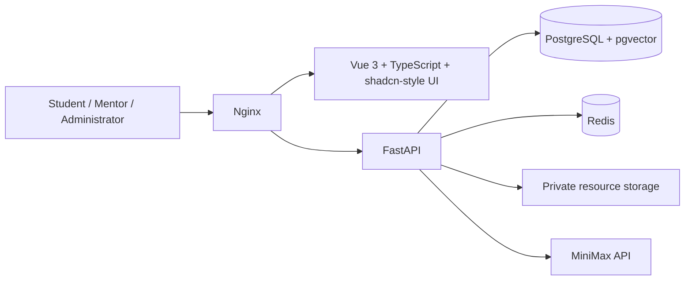

# 智导未来 · AcademicNexus

> 面向合作院校的 AI 驱动学术发展、师生互动与订阅权益平台。<br>
> An AI-enabled academic development, engagement, and subscription platform for partner institutions.

[](#更新日志--changelog)
[](#本地启动--local-start)
[](#技术架构--architecture)
[](#技术架构--architecture)

当前版本为 **`alpha-0823-NR`**。`NR` 表示 *Not Released*：这是本地验证版本，未经明确授权不得提交、推送或部署到生产环境。

## 项目概览 · Overview

智导未来服务于合作院校中的学生、教师和管理人员。平台以结构化学术画像为基础，提供师生匹配、双向选择、学习资源、AI 学术助手，以及与院校绑定的订阅权益管理。

AcademicNexus combines structured academic profiles, explainable matching, mutual selection, learning resources, an AI academic assistant, and institution-bound subscription entitlements.

### 核心能力 · Core capabilities

| 模块 | 已实现能力 |
| --- | --- |
| 身份与账户 | Excel 预注册、一次性 Access Key 激活、Argon2id 密码保护、登录、密码修改、令牌失效控制与中英语言偏好。 |
| 学术画像 | 学生与教师分别维护研究兴趣、能力、目标与学术经历；完成画像后才能进入对应业务流程。 |
| 师生互动 | 学生匹配教师、教师匹配学生、可解释的画像评分、师生双向选择与名额控制。 |
| 学习资源 | 教师上传课程、论文、书籍和附件；学生获得检索与画像关联推荐；资源配额由管理端控制。 |
| AI 学术助手 | 持久化多轮对话、每账户最多 100 条会话、自动命名/可改名、日期显示、Markdown 安全渲染、流式与普通模式、轻量/标准/专家模型档位。 |
| 订阅权益 | 基础、Pro、Ultra、Max 四档订阅周期与额度；院校配额、批量签发 Key、Excel 回执、回收未使用 Key 和院校绑定验证。 |
| 离线派发 | 管理员导入本地 Key 回执后在线核验；可直接激活符合条件的用户，或导出中英双语、机读卡风格 PDF 通知单。 |
| 管理与合规 | 超级管理员与院校管理员分级权限、院校范围隔离、关于页面、条款、隐私、AI 使用和可接受使用等合规页面。 |

## 技术架构 · Architecture



| 层级 | 技术 |
| --- | --- |
| Web | Vue 3、TypeScript、Vite、Tailwind、Reka UI、DOMPurify、vue-i18n。 |
| API | FastAPI、SQLAlchemy、Pydantic、Alembic、PyJWT、pwdlib/Argon2id。 |
| 数据与运行 | PostgreSQL + pgvector、Redis、Docker Compose、Nginx。 |
| 文档与导出 | openpyxl、ReportLab、PDF/ZIP 和 XLSX 内存流。 |

## 角色与权限 · Roles and access

| 角色 | 权限边界 |
| --- | --- |
| 学生 / 教师 | 使用自身画像、匹配、选择、资源、AI 助手和订阅页面。被指派为院校管理员后，仍可按学生/教师入口使用原有功能。 |
| 院校管理员 | 仅管理被分配院校内的学生、教师、订阅配额、Key 和离线派发流程。 |
| 超级管理员 | 管理全部院校、管理员指派、院校订阅配额及跨院校账户。 |

前后端都会执行角色和院校范围校验；界面隐藏不构成授权，所有敏感操作必须通过服务端验证。

## 订阅与 Key 规则 · Subscription model

- 基础订阅：每个普通订阅周期 10 次 AI 额度。
- 高级订阅：Pro 为 50 次、Ultra 为 100 次、Max 为 200 次；高级订阅从激活日开始，到下一订阅日结束。
- 高级订阅结束时自动回落基础订阅，并在新的基础周期重置 10 次额度。
- 高级订阅期间不能改为其他高级档位或主动降为基础订阅。
- Subscription Key 格式为 `XX-X-XXXX-XXX`；服务端仅保存受 Pepper 保护的指纹和 Argon2id 校验值，不保存明文。
- Key 与院校强绑定。已激活 Key 永久失效；未激活 Key 可以回收并返还院校库存，回收后不可再次使用。
- Excel 回执、PDF 通知单和 Key 校验均采用内存流处理，不会把明文 Key 写入服务器存储。下载型响应设为 `no-store`，并对表格导出应用公式注入防护。

## 本地启动 · Local start

### 前置条件

- Docker Desktop / Docker Engine with Compose v2
- Node.js 22（仅在宿主机执行前端检查时需要）
- 真实的 MiniMax API Key 仅放入私有 `.env`；未配置时 AI 接口会明确返回不可用，不会扣减额度。

### 配置

```powershell
Copy-Item .env.example .env
```

在 `.env` 中将每一个 `CHANGE_ME` 替换为独立的随机密值。不要把 `.env`、Key 回执、导出文件或用户数据纳入 Git。

### 运行

```powershell
docker compose up --build
```

默认入口为 `http://localhost:8080`，API 仅绑定 `127.0.0.1:8000`。开发热更新使用显式覆盖文件：

```powershell
docker compose -f docker-compose.yml -f docker-compose.dev.yml up --build
```

Debian 服务器上的首次初始化请使用交互脚本：

```bash
chmod +x scripts/manage.sh
./scripts/manage.sh install
./scripts/manage.sh init
```

## 验证 · Verification

```powershell
# 后端：在已启动的 API 容器中运行
docker compose exec -T api pytest -q

# 前端：在 frontend 目录中运行
npm run test:run
npm run build

# Compose 配置检查
docker compose config -q

# 忽略规则与空白检查
git check-ignore -v .env storage/resources output
git diff --check
```

自动化测试覆盖账户激活、密码安全、Access Key、Excel 导入安全、师生匹配与选择、资源配额、AI 对话与额度、订阅周期、院校管理员范围、离线 Key 校验、PDF 导出和直接激活。

## 安全边界 · Security boundaries

- 密码使用 Argon2id；未知账户/Key 使用伪哈希校验，减少时间侧信道泄露。
- JWT 包含认证版本；改密、重置或停用账户后，旧令牌即时失效。
- Access Key 与 Subscription Key 采用密码学安全随机数、全局唯一的 HMAC 指纹、一次性状态机与事务锁。
- Nginx 仅暴露 Web 入口；API 端口绑定回环地址。登录、激活、订阅 Key 激活、导入与 AI 消息都有限流。
- AI 流式响应关闭代理缓冲，以保证增量输出；回答完成前后均以事务方式处理配额，失败会回滚预占。
- CSP、防嵌入、MIME 嗅探防护、权限策略、DOMPurify 和受限 Markdown 渲染共同降低 Web 注入风险。
- XLSX 导入在解压前限制条目数和解压大小；资源上传限制扩展名、大小、存储根目录和路径穿越。

> [!WARNING]
> 当前 Alpha 默认使用 HTTP，仅适合受控测试。外网正式上线前必须配置域名、TLS/HTTPS、生产 CORS 白名单、备份与恢复演练、监控告警、独立日志保留策略和安全评估。

## 数据清理 · Runtime reset

仅清空项目运行数据而保留 `.env` 配置：

```powershell
docker compose down --volumes --remove-orphans
```

`scripts/manage.sh destroy` 会额外删除该项目的 `.env` 私有密钥和上传资源，执行前要求输入 `DESTROY`。它不会删除源代码、Git 历史或无关 Docker 资源。

## 仓库卫生 · Repository hygiene

`.gitignore` 排除私有配置、密钥、上传文件、运行卷数据、导入/导出回执、PDF 输出、临时渲染、测试报告、构建产物、旧项目和内部材料。提交前至少执行：

```powershell
git status --short
git diff --check
git diff --cached --name-only
```

未经项目负责人的明确命令，**不得执行 `git commit` 或 `git push`**。

## 更新日志 · Changelog

### alpha-0823-NR — 2026-08-23

- 完成院校订阅体系：基础 / Pro / Ultra / Max 周期额度、院校库存、批量 Key 签发、回收和院校绑定验证。
- 建立超级管理员与院校管理员的服务端范围隔离，并新增院校管理员指派和院校中心化管理界面。
- 新增离线 Key 派发：Excel 导入核验、直接激活、通用或指定对象 PDF 通知单、ZIP 导出与中英双语机读卡版式。
- 完善 AI 助手：100 条会话上限、删除/命名/日期、模型深度、普通/流式模式、流式滚动体验与订阅周期配额展示。
- 修复 AI 配额响应遗漏订阅周期字段造成的首次加载和流式完成失败；流式连接异常时会恢复已持久化的问答，而不清空回答。
- 增加关于页面、版权归属、法律与合规内容、全局中英适配与管理员身份标签。
- 加固安全：订阅 Key 激活网关限流、AI SSE 代理禁缓冲、Excel 回执公式注入防护、私有输出/临时目录忽略规则和运行数据清理流程。
- 完成本地运行数据重置与项目收尾审计；本次版本保持未发布状态。

### alpha-0822-NR — 2026-08-22

- 建立预注册激活、学术画像、匹配、双向选择、资源库、基础 AI 助手、Docker 部署与双语界面基础能力。

## 相关文档 · Project documents

- [第一阶段：用户与账户系统](docs/phase1-user-system.md)
- [第二阶段：学术画像](docs/phase2-academic-portraits.md)
- [第三阶段：订阅与院校管理员](docs/phase3-subscriptions-and-institution-admins.md)
- [第三阶段：离线订阅派发](docs/phase3-offline-subscription-delivery.md)

---

**智导未来 · AcademicNexus**<br>
`alpha-0823-NR` · Internal Alpha · Not Released

---

# English Version

## AcademicNexus

> AI-enabled academic development, student–mentor engagement, and subscription entitlements for partner institutions.

**Current release:** `alpha-0823-NR` — *Not Released*. This is an internal Alpha verification build. Do not commit, push, or deploy it without the project owner's explicit authorization.

## Overview

AcademicNexus serves students, mentors, institution administrators, and super administrators. It combines structured academic profiles with explainable matching, mutual selection, learning-resource management, an AI academic assistant, and institution-bound subscription entitlements.

### Delivered capabilities

| Area | Implementation |
| --- | --- |
| Identity and accounts | Excel pre-registration, one-time Access Key activation, Argon2id passwords, sign-in, password changes, token invalidation, and Chinese/English language preferences. |
| Academic profiles | Separate student and mentor profiles for interests, skills, goals, and academic experience. Profile completion gates access to relevant workflows. |
| Student–mentor engagement | Student-to-mentor and mentor-to-student matching, explainable profile scores, mutual selection, and capacity controls. |
| Learning resources | Mentor-managed courses, papers, books, and attachments; student search and profile-informed recommendations; administrator-controlled storage quotas. |
| AI academic assistant | Persisted multi-turn conversations, a 100-conversation limit per account, automatic and editable titles, dates, sanitized Markdown, streaming and standard responses, plus Light, Standard, and Expert model tiers. |
| Subscriptions | Basic, Pro, Ultra, and Max entitlement cycles; institution inventory; batch Key issuance; Excel receipts; unused Key reclamation; and institution-bound redemption. |
| Offline delivery | In-memory validation of imported Key receipts, direct activation for eligible users, and bilingual machine-card-style PDF notices for named or general delivery. |
| Administration and compliance | Super-administrator and institution-administrator scopes, institution isolation, About content, and legal pages for terms, privacy, AI use, acceptable use, and related policies. |

## Architecture


| Layer | Technology |
| --- | --- |
| Web | Vue 3, TypeScript, Vite, Tailwind, Reka UI, DOMPurify, and vue-i18n. |
| API | FastAPI, SQLAlchemy, Pydantic, Alembic, PyJWT, and pwdlib/Argon2id. |
| Runtime | PostgreSQL + pgvector, Redis, Docker Compose, and Nginx. |
| Documents | openpyxl, ReportLab, in-memory XLSX/PDF generation, and ZIP delivery. |

## Roles and access

| Role | Scope |
| --- | --- |
| Student / Mentor | Uses their own profile, matching, selection, resources, AI assistant, and subscription pages. An assigned institution administrator still retains the student or mentor experience. |
| Institution administrator | Manages only users, subscription inventory, Keys, and offline delivery activities for assigned institutions. |
| Super administrator | Manages all institutions, administrator assignments, institution subscription allocation, and cross-institution accounts. |

The API enforces role and institution scope on every sensitive operation. Hiding a control in the user interface never grants authorization.

## Subscription and Key model

- Basic subscribers receive 10 AI credits in each normal subscription cycle.
- Premium plans provide 50 credits for Pro, 100 for Ultra, and 200 for Max. A premium cycle starts when its Key is activated and ends on the corresponding subscription date in the following month.
- At the end of a premium cycle, the account returns to Basic and starts a new 10-credit normal cycle.
- A user with an active premium plan cannot switch to another premium plan or voluntarily downgrade to Basic.
- Subscription Keys use the `XX-X-XXXX-XXX` format. The server retains only a Pepper-protected fingerprint and an Argon2id verifier, never plaintext.
- A Key is bound to its institution. Activated Keys are permanently consumed; issued Keys can be reclaimed once, restoring institution inventory and permanently invalidating the Key.
- Key receipts, delivery PDFs, and validation operate in memory. Download responses use `no-store`, and spreadsheet exports neutralize formula prefixes.

## Local start

### Prerequisites

- Docker Desktop or Docker Engine with Compose v2
- Node.js 22 only when running frontend checks on the host
- A real MiniMax API Key stored exclusively in the private `.env` file. If it is absent, the AI endpoint reports that it is unavailable and does not deduct credits.

### Configure

```powershell
Copy-Item .env.example .env
```

Replace every `CHANGE_ME` value with a distinct randomly generated secret. Never add `.env`, Key receipts, generated exports, or user data to Git.

### Run

```powershell
docker compose up --build
```

The default entry point is `http://localhost:8080`; the API is bound to `127.0.0.1:8000` only. Use the explicit development override for hot reload:

```powershell
docker compose -f docker-compose.yml -f docker-compose.dev.yml up --build
```

For first-time setup on Debian:

```bash
chmod +x scripts/manage.sh
./scripts/manage.sh install
./scripts/manage.sh init
```

## Verification

```powershell
# Backend tests in a running API container
docker compose exec -T api pytest -q

# Frontend checks from frontend/
npm run test:run
npm run build

# Compose and repository checks
docker compose config -q
git check-ignore -v .env storage/resources output
git diff --check
```

Automated coverage includes activation, password handling, Access Keys, secure Excel import/export, matching, mutual selection, resource quotas, AI conversations and credits, subscription cycles, administrator scope, offline Key validation, PDF export, and direct activation.

## Security boundaries

- Passwords use Argon2id. Unknown accounts and Keys run through a dummy verifier to reduce timing disclosure.
- JWTs include an authentication version, so password changes, resets, and account suspension invalidate earlier tokens.
- Access Keys and Subscription Keys use CSPRNG generation, globally unique HMAC fingerprints, one-time state transitions, and transactional locks.
- Nginx is the sole public entry point. The API is loopback-bound; login, activation, Subscription Key activation, imports, and AI messages are rate-limited.
- Nginx disables buffering for AI event streams. Quotas are reserved transactionally and released when upstream generation fails.
- CSP, anti-framing headers, MIME-sniffing protection, a permissions policy, DOMPurify, and a constrained Markdown renderer reduce web-injection exposure.
- XLSX imports have archive-entry and uncompressed-size limits. Resource uploads are restricted by extension, size, storage root, and path traversal checks.

> [!WARNING]
> The Alpha configuration uses HTTP and is suitable only for controlled testing. Public production launch requires a domain, TLS/HTTPS, a production CORS allowlist, backup/restore exercises, monitoring and alerting, log-retention controls, and a security assessment.

## Runtime reset

To remove project runtime data while retaining the private `.env` configuration:

```powershell
docker compose down --volumes --remove-orphans
```

`scripts/manage.sh destroy` additionally removes the project `.env` secrets and uploaded resources after a `DESTROY` confirmation. It preserves source code, Git history, and unrelated Docker resources.

## Repository hygiene

The `.gitignore` excludes private configuration, credentials, uploads, runtime data, Key receipts, PDF output, temporary rendering, test reports, build outputs, legacy material, and private project documents.

Before a commit, run:

```powershell
git status --short
git diff --check
git diff --cached --name-only
```

Do not run `git commit` or `git push` without explicit project-owner authorization.

## Changelog

### alpha-0823-NR — 2026-08-23

- Added the institution subscription system: Basic / Pro / Ultra / Max cycles, institution inventory, batch Key issuance, reclaiming, and institution binding.
- Added server-enforced super-administrator and institution-administrator scopes, administrator assignment, and institution-centred administration views.
- Added offline Key delivery: Excel validation, direct activation, named or general PDF notices, ZIP export, and bilingual machine-readable card styling.
- Enhanced the AI assistant with the 100-conversation cap, deletion, naming, dates, model depth, response modes, scrolling conversation UX, and subscription-cycle quotas.
- Fixed the AI quota response fields that caused initial AI loading and streamed completion failures; the client now recovers a persisted turn if a terminal stream event fails.
- Added the About page, project copyright, legal/compliance content, global Chinese/English adaptation, and administrator identity labels.
- Hardened Subscription Key activation rate limits, AI SSE proxy buffering, spreadsheet formula injection prevention, private artifact ignores, and runtime-cleanup procedures.
- Reset local runtime data and completed the Alpha close-out audit. This version remains unreleased.

### alpha-0822-NR — 2026-08-22

- Delivered the foundation for pre-registration activation, academic profiles, matching, mutual selection, resources, the baseline AI assistant, Docker deployment, and bilingual UI.

## Project documents

- [Phase 1: User and account system](docs/phase1-user-system.md)
- [Phase 2: Academic portraits](docs/phase2-academic-portraits.md)
- [Phase 3: Subscriptions and institution administrators](docs/phase3-subscriptions-and-institution-admins.md)
- [Phase 3: Offline subscription delivery](docs/phase3-offline-subscription-delivery.md)

---

**AcademicNexus · 智导未来**<br>
`alpha-0823-NR` · Internal Alpha · Not Released
